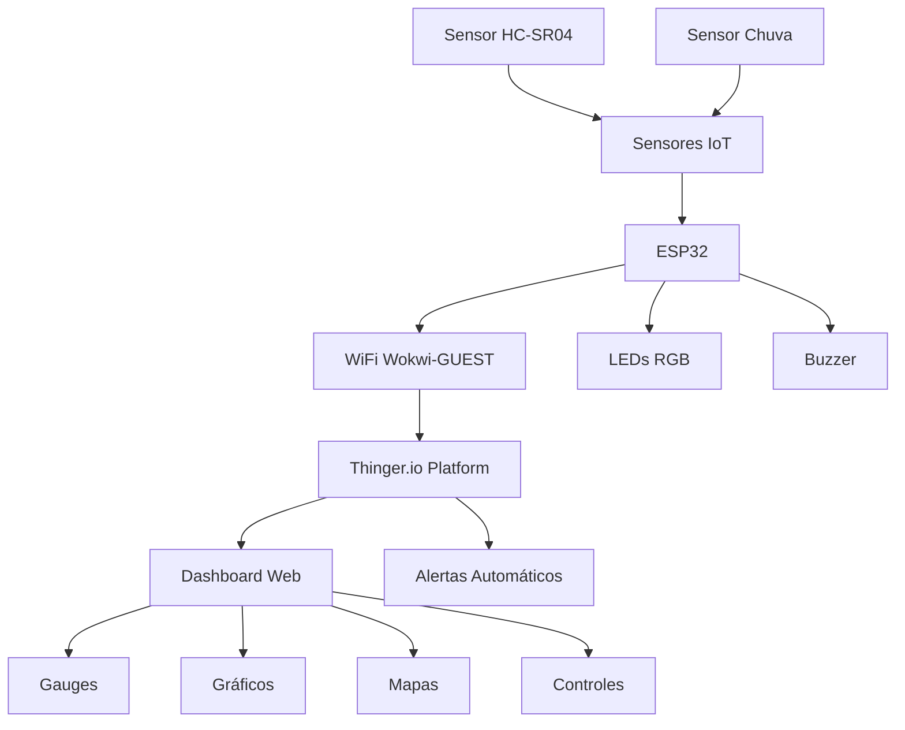

# 🌊 Sistema IoT de Monitoramento de Enchentes Urbanas

## 🎯 Descrição do Projeto

O **Sistema IoT de Monitoramento de Enchentes Urbanas** é uma solução inovadora desenvolvida para a **FIAP Global Solution 2025** que visa prevenir desastres causados por enchentes em áreas urbanas através do monitoramento em tempo real dos níveis de água.

### O que faz?
- Monitora continuamente o nível de água em pontos críticos da cidade
- Emite alertas preventivos automáticos baseados em três níveis de risco
- Fornece dashboard em tempo real para autoridades e população
- Simula cenários realistas para treinamento e demonstração

### Por que foi desenvolvido?
Com o aumento da frequência de eventos climáticos extremos, especialmente em centros urbanos como São Paulo, há uma necessidade urgente de sistemas de alerta precoce que possam salvar vidas e reduzir danos materiais causados por enchentes súbitas.

### Que problema resolve?
- **Falta de monitoramento contínuo** em áreas de risco
- **Alertas tardios** à população e autoridades
- **Ausência de dados históricos** para análise de padrões
- **Comunicação inadequada** durante emergências

## 🌟 Motivação

Este projeto nasceu da necessidade urgente de criar soluções tecnológicas para eventos climáticos extremos, alinhando-se com o desafio da **FIAP Global Solution 2025: Eventos Extremos**. 

**Estatísticas que nos motivaram:**
- São Paulo registra mais de 600 pontos de alagamento durante períodos chuvosos
- Enchentes causam prejuízos de bilhões de reais anualmente no Brasil
- Sistemas de alerta podem reduzir em até 80% as perdas humanas e materiais

## ⚡ Funcionalidades

### 🚨 Sistema de Alertas Inteligentes
- **🟢 Normal (0-69%)**: Operação padrão, LED verde ativo
- **🟡 Alerta (70-89%)**: Situação de atenção, LED amarelo + notificações
- **🔴 Emergência (90-100%)**: Risco iminente, LED vermelho + buzzer + alertas máximos

### 📊 Monitoramento em Tempo Real
- Medição contínua do nível de água via sensor ultrassônico HC-SR04
- Detecção de intensidade de chuva
- Atualização de dados a cada 3 segundos
- Geolocalização dos sensores (-23.5505, -46.6333)

### 🎮 Modos de Simulação
1. **Automático**: Ciclo completo de enchente (2 minutos)
2. **Normal**: Nível estável em 30%
3. **Alerta**: Nível fixo em 75%
4. **Emergência**: Nível crítico em 95%
5. **Chuva Intensa**: Simulação de tempestade com subida gradual

### 🎛️ Controle Remoto
- Controle individual de LEDs via dashboard
- Ativação remota do buzzer
- Calibração do sistema à distância
- Mudança de modos de operação

### 📱 Dashboard Interativo
- Gauges visuais com cores de alerta
- Gráficos históricos de tendência
- Mapa de localização dos sensores
- Tabela de informações técnicas em tempo real

## 🏗️ Arquitetura do Sistema



### Componentes Principais:
- **Hardware**: ESP32, HC-SR04, LEDs, Buzzer, Sensores
- **Conectividade**: WiFi, Protocolo IoTMP (Thinger.io)
- **Plataforma**: Thinger.io para gateway e dashboard
- **Simulação**: Wokwi para desenvolvimento e testes

## 🛠️ Tecnologias Utilizadas

### Hardware
- **ESP32 DevKit v1**: Microcontrolador principal com WiFi integrado
- **HC-SR04**: Sensor ultrassônico para medição de distância/nível
- **LEDs RGB**: Indicadores visuais de status
- **Buzzer**: Alerta sonoro para emergências
- **Photoresistor**: Simulação de sensor de chuva

### Software
- **Arduino IDE**: Desenvolvimento do firmware
- **C++**: Linguagem de programação
- **ThingerESP32**: Biblioteca para comunicação IoT
- **ArduinoJson**: Manipulação de dados JSON

### Plataformas
- **Thinger.io**: Dashboard e gerenciamento IoT
- **Wokwi**: Simulador online para ESP32
- **GitHub**: Controle de versão e documentação

### Protocolos
- **IoTMP**: Internet of Things Message Protocol (Thinger.io)
- **HTTP/JSON**: Comunicação web padrão
- **WiFi 802.11**: Conectividade wireless

## 📋 Pré-requisitos

### Hardware (Opcional - funciona no simulador)
- ESP32 DevKit v1
- Sensor HC-SR04
- 3x LEDs (vermelho, verde, azul)
- 1x Buzzer
- 1x Photoresistor
- Resistores (220Ω e 10kΩ)
- Protoboard e jumpers

### Software
- Conta no [Thinger.io](https://thinger.io)
- Acesso ao [Wokwi](https://wokwi.com) (simulador)

### Conhecimentos
- Básico de Arduino/C++
- Conceitos de IoT
- Navegação em dashboards web

## 🚀 Instalação e Configuração

### 1. Configuração da Conta Thinger.io

```bash
# 1. Acesse https://thinger.io e crie uma conta gratuita
# 2. Crie um novo dispositivo:
#    - Device Type: IOTMP Device (Thinger.io protocol)
#    - Device ID: rain_controller
#    - Description: Sistema de Monitoramento de Enchentes
# 3. Anote as credenciais geradas
```

### 2. Configuração do Código

```cpp
// Atualize estas credenciais no código Arduino:
#define USERNAME "seu_usuario_thinger"
#define DEVICE_ID "rain_controller"  
#define DEVICE_CREDENTIAL "sua_credencial_gerada"
```

### 3. Execução no Wokwi

```bash
# 1. Acesse https://wokwi.com
# 2. Crie um novo projeto ESP32
# 3. Cole o código fornecido
# 4. Execute a simulação
# 5. Verifique a conexão no Thinger.io
```

### 4. Configuração do Dashboard

1. **Crie um novo dashboard** no Thinger.io
2. **Adicione os widgets essenciais**:
   - Gauge: Nível de Água (0-100%)
   - Gauge: Intensidade da Chuva (0-100%)
   - Value: Status do Sistema
   - Time Series: Gráfico histórico
   - Switch: Controle do buzzer

## 📖 Como Usar

### Iniciando o Sistema

1. **Execute o código no Wokwi**
   ```
   # O sistema iniciará automaticamente em modo de simulação
   # Verifique no Serial Monitor as mensagens de inicialização
   ```

2. **Monitore no Dashboard**
   ```
   # Acesse seu dashboard no Thinger.io
   # Observe os dados chegando em tempo real
   # Teste os controles remotos
   ```

### Interpretando os Dados

#### Status dos LEDs:
- **🟢 Verde**: Situação normal (0-69%)
- **🟡 Amarelo**: Alerta preventivo (70-89%)
- **🔴 Vermelho**: Emergência (90-100%)

#### Buzzer:
- **Inativo**: Situações normais e de alerta
- **Ativo Intermitente**: Apenas em emergências (>90%)


### Modos de Simulação

| Modo | Descrição | Nível de Água | Intensidade Chuva |
|------|-----------|---------------|-------------------|
| 0 | Automático | Ciclo completo (2 min) | Variável |
| 1 | Normal | 30% ± 5% | 0-20% |
| 2 | Alerta | 75% ± 3% | 40-60% |
| 3 | Emergência | 95% ± 2% | 70-90% |
| 4 | Chuva Intensa | Subida gradual | 80-100% |

### Logs de Exemplo

```
================================================
     SISTEMA DE MONITORAMENTO DE ENCHENTES     
================================================
🌊 Nível da Água: 75.0% (🟡)
🌧️ Intensidade Chuva: 45% (🌧️)
📏 Distância Simulada: 25.0 cm
📊 Status do Sistema: ALERTA 🟡
🎮 Modo Simulação: 2 (Alerta)
💡 LEDs: R=🔴 G=🟢 B=⚫
🔊 Buzzer: 🔇 INATIVO
📶 WiFi: CONECTADO ✅ (192.168.1.100)
📱 Thinger.io: CONECTADO ✅
⏰ Uptime: 247s
================================================
```

## 👥 Equipe

### Desenvolvedores

| Nome | RM | 
|------|----|
| Carlos Eduardo Rodrigues Coelho Pacheco | RM 557323 |
| João Pedro Amorim Brito Virgens | RM 559213 | 
| Pedro Augusto Costa ladeira | RM 558514 | 

---

## 🏆 Global Solution 2025

Este projeto foi desenvolvido como parte do desafio **FIAP Global Solution 2025: Eventos Extremos**, demonstrando como a tecnologia pode ser aplicada para criar soluções inovadoras.

### Disciplinas Envolvidas:
- **DISRUPTIVE ARCHITECTURES: IOT, IOB & GENERATIVE IA**
- **ADVANCED BUSINESS DEVELOPMENT WITH .NET**
- **JAVA ADVANCED**
- **MOBILE APPLICATION DEVELOPMENT**
- **DEVOPS TOOLS & CLOUD COMPUTING**
- **MASTERING RELATIONAL AND NON-RELATIONAL DATABASE**

---

**🌊 Protegendo vidas através da tecnologia | FIAP 2025 | Sistema IoT de Monitoramento de Enchentes** 🌊
